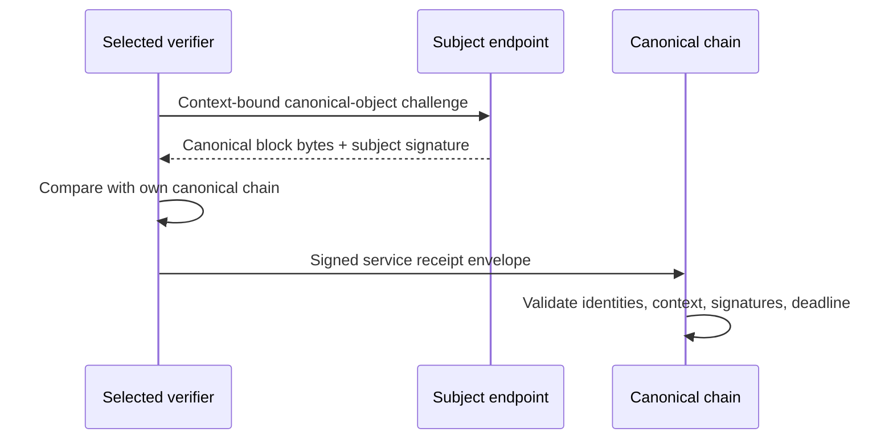

# EPoSE overview

> **Verified against:** [Pinned source and release revisions](../reports/source-version-matrix.md), Qwertycoin mainnet where applicable, 2026-09-29.

> **Protocol:** HF17 / EPoSE protocol 2, mainnet activation height 0.  
> **Verified:** Core `v2.0.2` and development `a71c0eb2`, 2026-09-29.

EPoSE rewards useful, independently verifiable service. It does **not** replace RandomX proof of work: miners still produce blocks and determine chain selection. It is not staking, and running an ordinary full node alone does not qualify.

The implemented service kind is `canonical-object`:

The transcript proves that the selected subject served and signed the requested canonical object in the bound context and that an authorized verifier checked it. It does not prove perfect uptime or every aspect of service quality. HTTP success, local execution, local submission and a log line are not canonical qualification evidence.

Consensus validates recorded transcripts without DNS lookups, wall-clock checks or live network requests. Endpoint discovery/probing is an operational step performed before a receipt reaches consensus.

Continue with [Service Node Quickstart](service-node-quickstart.md), [Epochs and Qualification](epochs-and-qualification.md), and [Rewards](rewards.md).

