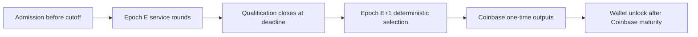

# EPoSE rewards

> **Verified against:** Core `v2.0.2` reward and Coinbase validation, Qwertycoin mainnet, 2026-09-29.

When a qualified payee exists, 10% of the scheduled subsidy—not transaction fees—is allocated to service:

```text
service = floor(scheduled_subsidy * 1000 / 10000)
miner   = scheduled_subsidy - service + transaction_fees
```

Example: if scheduled subsidy is `34,400,000,000` atomic units (344 QWC) and fees are `12,345` atomic units, service receives `3,440,000,000` atomic units (34.4 QWC) and the miner receives `30,960,012,345`. Integer division floors the service amount; all arithmetic is checked.

A block in payout epoch `E` uses only the closed qualified set from service epoch `E-1`. Selection is deterministic and rotates over the canonically ordered set. Epoch 0 has no service reward; epoch 1 is the first service epoch; height 1440 (start of epoch 2) is the first possible payout. This does not promise any newly started node a reward at a fixed wall-clock time.



If the closed source set is legitimately empty, mainnet's compiled `miner_fallback` gives the entire subsidy and fees to the miner; no service node is paid. Missing/corrupt consensus state is not an empty set and fails closed.

Service outputs are normal wallet-detectable one-time outputs and obey Coinbase maturity. `get_service_rewards` previews a height using the correct source epoch; `get_epose_block_reward` verifies a canonical historical block. Never infer attribution solely from output position or current-epoch flags.
