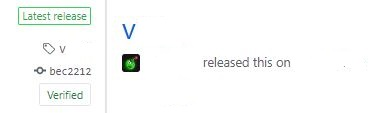
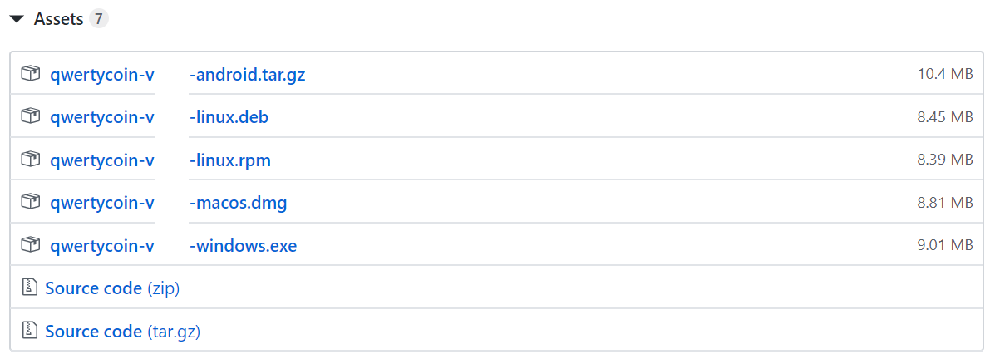

# CLI Wallet

CLI Wallet is a desktop platform software programmed to run on Windows, Mac or Linux operating system using Command Line Interface.

## Download CLI Wallet Software

You can find the binary distributions [here](https://github.com/qwertycoin-org/qwertycoin/releases/latest).

Check the version of the software and make sure that it is marked with "Latest release" with "Verified" Symbol. 



Within that version of release, scroll down and you will find a list of files that has the same version number of the latest release.



From here you will be able to choose the appropriate file for your chosen platform \(ex. Linux, Windows, Mac\). The binaries are provided in .zip files.

## Install

### Linux

Extract the .zip file

```text
upzip qwertycoin-linux-v5.0.0.zip
```

### Windows

Extract the .zip file

```text
qwertycoin-win64-v5.0.0.zip
```

### Mac

Download .dmg file

## Syncing the Blockchain

Running `qwertycoind` will start the network daemon which will start downloading and verifying the Qwertycoin blockchain.

This can take sometime because qwertycoind must verify every block.

### Syncing the Blockchain Using Checkpoints

You can sync the blockchain much faster by using checkpoints.

#### Setup

* Right click [this link](https://github.com/qwertycoin-org/checkpoints/raw/master/checkpoints.csv) and choose `Save link as...` to download the latest checkpoints.csv.
* Place checkpoints.csv in the same folder as your Qwertycoind daemon
* You can get Qwertycoind from here if you don't have it already: [https://github.com/qwertycoin-org/qwertycoin/releases](https://github.com/qwertycoin-org/qwertycoin/releases)
* Make sure you shut down any GUI wallets, or any other instances of Qwertycoind.

#### Usage

**Linux, Apple**

* First, open a command prompt in the same directory as Qwertycoind.
* You can use the `cd` command to change to this directory. For example, `cd Downloads/qwertycoincoin-v3.0.1`
* Alternatively, your file manager may provide the ability to open a terminal in your current directory. Navigate to the folder with Qwertycoind in, and try right clicking, to see if you can open a terminal there:
* Finally, type `./Qwertycoind --load-checkpoints checkpoints.csv` in the terminal.

**Windows**

* First, open a command prompt in the same directory as Qwertycoind.
* This can easily be done by moving to the Qwertycoind directory in Windows Explorer, then typing `cmd` in the search bar and hitting enter:
* Finally, type Qwertycoind.exe --load-checkpoints checkpoints.csv in the command prompt.

#### Expected Output

If you did the steps correctly, you should see something like this output.

```text
2018-May-13 11:58:39.654478 INFO    Welcome to Qwertycoind v3.0.1.1948 (HEAVY)
2018-May-13 11:58:39.654914 INFO    Module folder: Qwertycoind
2018-May-13 11:58:39.655249 INFO    Loading Checkpoints for faster initial sync...
2018-May-13 11:58:40.854979 INFO    Loaded 90695 checkpoints from checkpoints.csv
```

* Qwertycoind will then start syncing from checkpoints.
* If you are using the CLI wallet, then you can just wait for it to finish syncing, and open your wallet.
* If you are using a GUI wallet, let it finish syncing, close it down by typing `exit` in the window, then open your GUI wallet.

## Using Simplewallet

With `qwertycoind` still running in the background or another terminal prompt, open simplewallet.

### Linux/Mac

```text
./simplewallet
```

### Windows

Run the `simplewallet.exe` executable from the extracted folder.

## Simplewallet Commands

### Generate a wallet

To create a wallet, type `G` and press `enter` and then answer the questions when prompted. I provided an example below.

```text
What do you want to do?: g
O - open wallet
G - generate new wallet
I - import wallet from keys
R - restore backup/paperwallet
T - import tracking wallet
E - exit

Specify wallet file name (e.g., wallet.bin).
Wallet file name: testwallet
password: **********
confirm password: **********
Generated new wallet: QWC1PHRpPucbuQ9PGRG5n8TnGttFhdQ5yatecnQS9kz3F1Su2EodYiUBGVT3mwzpVfXkbTd6YEuR5J1ynrL8dBHP1SbYMGVDJ8
view key: 4f4572eacda8c813b7deb8614e0f7f317eed0de6779d38a51e4eed89eaf6f109
PLEASE NOTE: the following 25 words can be used to recover access to your wallet. Please write them down and store them somewhere safe and secure. Please do not store them in your email or on file storage services outside of your immediate control.

dialect vexed onion problems gadget jester kernels trolling boldly pegs knowledge sensible waveform bicycle guest paradise value pliers gnome quick unafraid network dwindling evaluate guest

[wallet QWC1fv]:
```

### Opening a Wallet

To open an existing wallet; type `o` and press `enter`. Enter your wallet's name and password when prompted.

### Additional Commands and What They Do

Commands:

* **address** - Show current wallet public address
* **balance**- Show current wallet balance
* **bc\_height** - Show blockchain height
* **exit** - Close wallet
* **export\_keys** - Show the secret keys of the opened wallet
* **get\_tx\_key** - Get secret transaction key for a given
* **help** - Show this help
* **incoming\_transfers** - Show incoming transfers
* **list\_transfers** - Show all known transfers
* **list\_msgs** - Show all known messages
* **outgoing\_transfers** - Show outgoing transfers
* **password** - Change password
* **payment\_id** - Generate random Payment ID
* **payments** - **payments &lt;payment\_id\_1&gt; \[&lt;payment\_id\_2&gt; ... &lt;payment\_id\_N&gt;\]** - Show payments &lt;payment\_id\_1&gt;, ... &lt;payment\_id\_N&gt;
* **reset** - Discard cache data and start synchronizing from the start
* **save** - Save wallet synchronized data
* **send\_msg** - **send\_msg &lt;addr\_1&gt; &lt;addr\_N&gt; -m "Here could be your Message" \[-ttl 1 - 840 Minutes\] \[-fee fee\] \[-a 0 or 1\]** ttl means time to live, its for self-destructing Messages only. 0 or 1 for anonymity on or off, if 0 the receiver will not see the last 16 digits from your Address.
* **set\_log-set\_log** - Change current log level, is a number 0-4
* **show\_seed** - Get wallet recovery phrase \(deterministic seed\)
* **sign\_message** - Sign the message
* **start\_mining** - start\_mining \[&lt;number\_of\_threads&gt;\] - Start mining in daemon
* **stop\_mining** - Stop mining in daemon
* **sweep\_dust** - Sweep unmixable dust
* **tracking\_key** - Show the tracking key of the opened wallet
* **transfer** - **transfer &lt;mixin\_count&gt; &lt;addr\_1&gt; &lt;amount\_1&gt; \[&lt;addr\_2&gt; &lt;amount\_2&gt; ... &lt;addr\_N&gt; &lt;amount\_N&gt;\] \[-p payment\_id\] \[-f fee\]** - Transfer &lt;amount\_1&gt;,... &lt;amount\_N&gt; to &lt;address\_1&gt;,... &lt;address\_N&gt;, respectively. &lt;mixin\_count&gt; is the number of transactions yours is indistinguishable from \(from 0 to maximum available\)
* **verify\_message** - Verify a signature of the message

